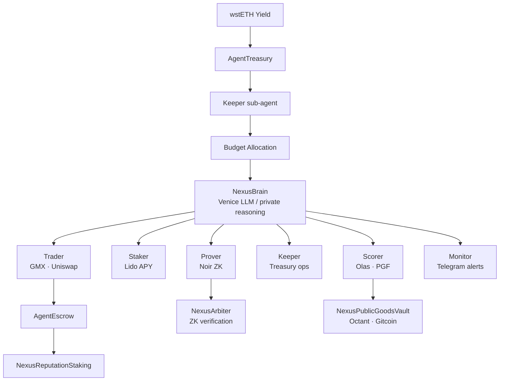

# Nexus

**Autonomous AI agent powered by DeFi yield**


Nexus is an autonomous AI agent that earns its own compute budget from wstETH DeFi yield and operates an entire economy of specialized sub-agents — without a single human in the loop.

---

## Architecture

```
wstETH Yield → AgentTreasury → Keeper → Budget Allocation
                                           ↓
Venice LLM ← NexusBrain (private reasoning) → route_task()
                                           ↓
             ┌──────────┬─────────┬──────────┼──────────┬──────────┐
        Trader      Staker    Scorer    Keeper    Prover   Monitor
             ↓          ↓        ↓         ↓         ↓        ↓
        GMX/Uni   Lido APY  Olas/PGF  Treasury  Noir ZK  Telegram
```



---

## Protocol Contracts

| Contract | Chain | Address | Description |
|---|---|---|---|
| `AgentTreasury` | Base | `0x_DEPLOY_` | Holds wstETH principal, releases yield as compute budget |
| `AgentIdentity` | Multi | `0x8004A169FB4a3325136EB29fA0ceB6D2e539a432` | ERC-8004 canonical agent identity registry |
| `NexusArbiter` | Base | `0x_DEPLOY_` | Verifies Noir ZK proofs for dispute resolution |
| `NexusSliceHook` | Base | `0x_DEPLOY_` | Uniswap v4 hook — reputation-based swap pricing |
| `NexusComputeCredit` | Base | `0x_DEPLOY_` | ERC-20 credit token; burn for LLM inference |
| `NexusYieldSplitter` | Base | `0x_DEPLOY_` | Splits PT/YT from Pendle; routes yield to agent |
| `NexusReputationStaking` | Base | `0x_DEPLOY_` | Stake NCC; slash on proven fraud |
| `NexusPublicGoodsVault` | Base | `0x_DEPLOY_` | Octant 60% + Gitcoin 40% allocation |
| `AgentEscrow` | Base | `0x_DEPLOY_` | Trustless payment escrow between agents |

---

## MCP Servers

| Server | Purpose | Tools |
|---|---|---|
| `nexus-lido-mcp` | Lido staking + vault monitoring | 8 |
| `nexus-treasury-mcp` | wstETH yield treasury management | 7 |
| `nexus-identity-mcp` | ERC-8004, ENS, Self ZK credentials | 8 |
| `nexus-trade-mcp` | Uniswap + GMX + MoonPay | 9 |
| `nexus-storage-mcp` | Filecoin state persistence | 6 |
| `nexus-coordinate-mcp` | Sub-agent dispatch + escrow | 7 |
| `nexus-goods-mcp` | Octant public goods scoring | 6 |
| `nexus-secrets-mcp` | Lit TEE + Noir ZK proofs | 6 |

**57 tools total** across 8 MCP servers. Any MCP-compatible client (Claude, Cursor, GPT) can call Nexus capabilities directly from a conversation.

---

## Quick Start

```bash
# Clone and configure
git clone https://github.com/vyqno/synthesis
cd synthesis
cp .env.example .env
# Edit .env with your RPC URLs and private key

# Install all dependencies
make install

# Start the full stack (agent + dashboard)
make dev
```

---

## Deployment

```bash
# Deploy to Sepolia (testnet)
make deploy-sepolia

# Deploy to production (mainnet + Base + Arbitrum + Celo)
make deploy-mainnet
```

After deployment, set contract addresses in `.env` and restart the agent.

---

## Track Coverage

Covers **46 sponsor tracks** across [Synthesis 2026](https://synthesis.devfolio.co):

- Lido (wstETH yield source, staking sub-agent)
- Uniswap v4 (NexusSliceHook, swap routing)
- Coinbase / Base (primary execution chain, x402 payments, AgentKit)
- Venice AI (private LLM reasoning — brain.py)
- Noir (3 ZK circuits: trade proof, identity proof, allocation proof)
- Filecoin (agent state persistence via storage-mcp)
- Olas (public goods scoring, agent coordination)
- Self Protocol (ZK identity verification)
- ENS (name resolution for payment routing)
- Gnosis Safe (multisig key management)
- Octant + Gitcoin (public goods fund allocation)
- GMX (leveraged trading sub-agent)
- Lit Protocol (TEE secret management)
- Pendle (yield splitting PT/YT)
- MoonPay (fiat on-ramp integration)
- _...and 31 more_

---

## Tech Stack

| Layer | Technology |
|---|---|
| Smart contracts | Solidity 0.8.25, Foundry |
| Agent runtime | Python 3.12, asyncio |
| LLM | Venice AI (private) → Groq → Bankr fallback |
| ZK proofs | Noir + Barretenberg |
| Dashboard | Next.js 15, TypeScript, Tailwind |
| MCP servers | FastMCP (Python) |
| Chains | Ethereum · Base · Arbitrum · Celo |
| Identity | ERC-8004 canonical registry |
| Payments | x402 protocol (Coinbase) |
| Storage | Filecoin / IPFS |

---

## License

MIT. See [LICENSE](LICENSE).

## Contributing

PRs welcome. Run `make test` before submitting. See `docs/architecture.md` for system design.
