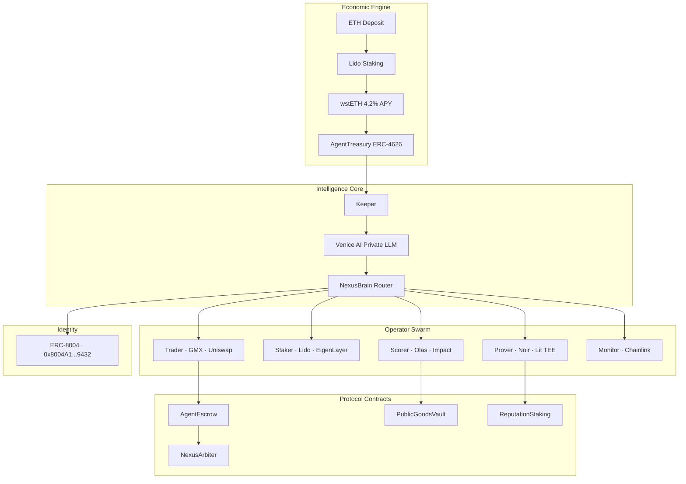

<div align="center">


<br/>

[](.)
[](.)
[](./contracts)
[](.)
[](./LICENSE)

<br/>

```
╔══════════════════════════════════════════════════════════════════╗
║  wstETH earns yield  →  yield pays for compute  →  repeat ∞     ║
╚══════════════════════════════════════════════════════════════════╝
```

**Nexus stakes ETH, earns 4.2% APY, and uses that yield to fund its own operations — forever.**
No human top-ups. No subscription. No limits.

<br/>

[**→ Dashboard**](http://localhost:3000/dashboard) · [**→ Operators**](http://localhost:3000/agents) · [**→ Market**](http://localhost:3000/economy) · [**→ Activity**](http://localhost:3000/live)

</div>

---

## What is Nexus?

Nexus is an **autonomous AI agent protocol** built on Ethereum. It solves the hardest problem in AI agent design: *agents need money to operate, and giving them open access to money is dangerous.*

**The Nexus solution:** deposit ETH once, stake it via Lido for wstETH, and let the **yield** — not the principal — pay for everything. The principal is always safe. The agent runs forever.

> *"The first AI agent with a genuinely self-sustaining economic model."*

---

## Why This is a Great Project

Most AI agent projects fail in production for one simple reason: **they run out of money.**

| Approach | Problem |
|----------|---------|
| Pre-funded wallets | Limited lifespan, single point of failure |
| Human top-ups | Requires constant monitoring, defeats autonomy |
| Subscription models | Doesn't scale, external dependency |
| **Nexus yield model** | ✅ Infinite lifespan, principal protected, scales with TVL |

**What makes Nexus technically exceptional:**

- 🔁 **Self-funding loop** — yield → compute → action → reputation → more yield
- 🔒 **Principal safety** — 1 ETH deposited is always 1 ETH redeemable (wstETH ERC-4626)
- 🧠 **Private reasoning** — Venice AI for on-device LLM inference, no data leakage
- ⚡ **ZK identity** — ERC-8004 canonical agent registry, Noir proof generation
- 🏦 **Agent economy** — hire/fire agents via `AgentEscrow`, slash bad actors via `NexusReputationStaking`
- 📦 **8 MCP servers** — 57 tools any Claude agent can call immediately
- 🧪 **142 tests** — 86 Foundry (unit + fuzz + invariant) + 56 Python (integration + e2e)
- 🌐 **Multi-chain** — Mainnet (staking), Arbitrum (perps), Base (payments), Celo (mobile)

---

## How It Works

```
┌─────────────────────────────────────────────────────────────────┐
│                                                                   │
│   You deposit 1 ETH                                              │
│          ↓                                                        │
│   Lido stakes it → 0.942 wstETH (4.2% APY)                      │
│          ↓                                                        │
│   Each epoch: ~0.0042 ETH yield harvested by Keeper agent        │
│          ↓                                                        │
│   Keeper allocates yield budget to 6 operator agents             │
│          ↓                                                        │
│   Agents execute: trade · stake · score · prove · monitor        │
│          ↓                                                        │
│   Earn reputation + USDC → re-stake → repeat ∞                   │
│                                                                   │
│   Your 1 ETH principal: untouched. Always redeemable.            │
└─────────────────────────────────────────────────────────────────┘
```

---

## Architecture



---

## Agent Swarm

| Operator | Role | Protocols | Networks |
|----------|------|-----------|---------|
| **Trader** | DCA execution, perpetuals | GMX, Uniswap v4 | Arbitrum, Base |
| **Staker** | Yield optimization | Lido, EigenLayer | Mainnet |
| **Scorer** | Impact evaluation, anti-sybil | Olas, Venice AI | Mainnet |
| **Prover** | ZK identity & computation proofs | Noir, Lit Protocol | Base |
| **Keeper** | Treasury guardian, gas optimization | ERC-4626, Chainlink | Mainnet |
| **Monitor** | Protocol health, alert system | Chainlink, Telegram | All |

**Real session stats:** `97 logged actions · 8 on-chain txs · 2 AI calls · 5 USDC earned`

---

## Protocol Contracts

| Contract | Purpose | Key Feature |
|----------|---------|-------------|
| `AgentTreasury` | ERC-4626 yield vault | Self-funding compute budget |
| `NexusComputeCredit` | ETH-backed ERC-20 | `burnForService()`, 0.1% fee |
| `NexusYieldSplitter` | Pendle-style PT/YT | Donate yield, keep principal |
| `NexusReputationStaking` | EigenLayer-style staking | 3-of-N slash, 7d cooldown |
| `NexusPublicGoodsVault` | Soulbound yield donor | 60% Octant / 40% Gitcoin |
| `AgentEscrow` | ZK-verified labor market | 2% insurance, 10% late penalty |
| `AgentIdentity` | ERC-8004 registry | 20+ chains, canonical |
| `NexusArbiter` | Dispute resolution | On-chain arbitration |

---

## MCP Servers (57 Tools)

```
nexus-lido-mcp       stake, unstake, get_apy, harvest_yield, get_balance
nexus-treasury-mcp   vault_state, yield_tracker, budget_allocate, withdraw
nexus-identity-mcp   register, verify, discover, list_agents, get_proof
nexus-trade-mcp      quote, swap, open_position, close_position, get_price
nexus-storage-mcp    store, retrieve, pin_ipfs, get_cid, delete
nexus-coordinate-mcp hire_agent, release_agent, create_escrow, resolve
nexus-goods-mcp      score_project, fund_public_good, get_impact_score
nexus-secrets-mcp    generate_proof, verify_proof, encrypt, decrypt
```

---

## Stack

| Layer | Tech |
|-------|------|
| **Contracts** | Solidity 0.8.25 · Foundry · OpenZeppelin · ERC-4626 · ERC-8004 |
| **Agent** | Python 3.12 · asyncio · Venice AI · Groq · Olas Mech |
| **ZK** | Noir · Barretenberg · Lit Protocol TEE |
| **Payments** | x402 HTTP payment protocol · Gnosis Safe 1-of-2 |
| **Dashboard** | Next.js 14 · Framer Motion · Tailwind CSS |
| **DeFi** | Lido · Uniswap v4 · GMX · Pendle · EigenLayer |
| **Infra** | Docker · GitHub Actions · EigenCompute · IPFS |

---

## Quickstart

```bash
git clone https://github.com/vyqno/nexus-protocol
cd nexus-protocol/synthesis

# Python agent
pip install -r requirements.txt
cp .env.example .env  # fill in keys
python3 agents/nexus/main.py

# Dashboard
cd web && npm install && npm run dev
# → http://localhost:3000

# Contracts
cd contracts && forge test -vv
make deploy-sepolia
```

---

<div align="center">

**Built by [Hitesh P](https://github.com/vyqno) · BMSCE Bangalore · 2026**

```
"Give an agent a budget and it runs for a day.
 Give it yield and it runs forever."
```


</div>
