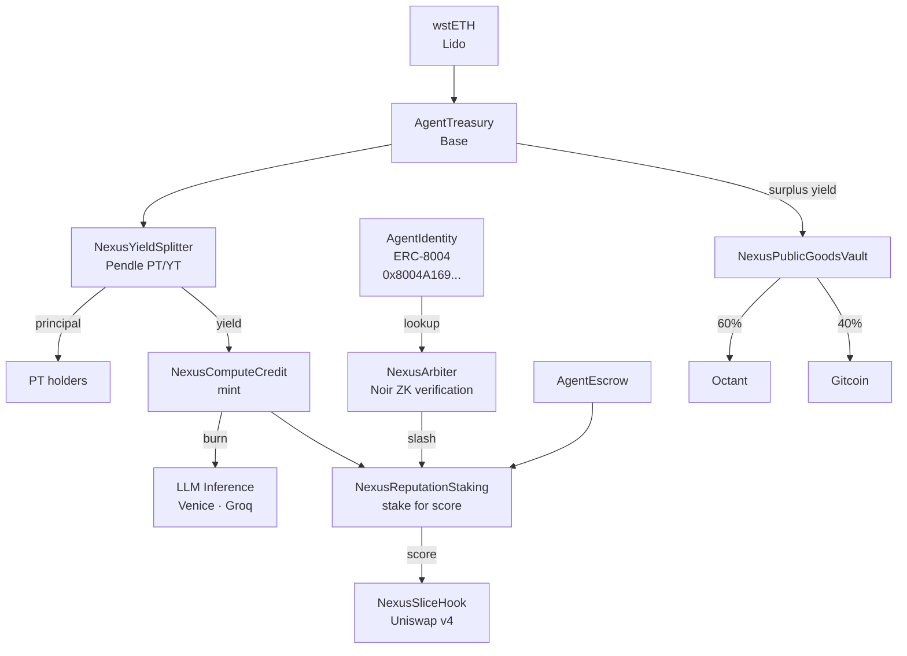

# Nexus Protocol Contracts

Smart contract architecture for the Nexus autonomous agent economy.

---

## Overview

| Contract | One-line description |
|---|---|
| `AgentTreasury` | Holds wstETH principal; releases staking yield as agent compute budget |
| `AgentIdentity` | ERC-8004 canonical agent identity registry — same address on 20+ chains |
| `NexusArbiter` | Accepts Noir ZK proofs and settles disputes between agents |
| `NexusSliceHook` | Uniswap v4 hook that prices swaps based on agent reputation score |
| `NexusComputeCredit` | ERC-20 credit token minted from yield; burned to pay for LLM inference |
| `NexusYieldSplitter` | Integrates Pendle finance to split PT/YT; routes YT yield to agent |
| `NexusReputationStaking` | Stake NCC for reputation; slash stake on ZK-proven fraud |
| `NexusPublicGoodsVault` | Allocates agent yield to Octant (60%) and Gitcoin (40%) |
| `AgentEscrow` | Trustless payment escrow for agent-to-agent service transactions |

---

## Architecture



---

## Contract Reference

### AgentTreasury

- **Inherits:** `Ownable`, `ReentrancyGuard`
- **Chain:** Base (primary), Ethereum mainnet (wstETH source)
- **Key functions:**
  - `depositWstETH(uint256 amount)` — deposit wstETH principal
  - `allocateBudget(address agent, uint256 amount)` — keeper releases yield as NCC
  - `getYieldAccrued()` — view current accrued yield
  - `emergencyWithdraw()` — Safe multisig recovery

### AgentIdentity

- **Inherits:** `ERC721`, `Ownable`
- **Chain:** Canonical — `0x8004A169FB4a3325136EB29fA0ceB6D2e539a432` (20+ chains)
- **Key functions:**
  - `registerAgent(string name, address operator)` — mint agent identity NFT
  - `getReputation(uint256 agentId)` — read on-chain reputation score
  - `updateReputation(uint256 agentId, int256 delta)` — called by Arbiter
  - `discoverAgent(bytes32 agentId)` — cross-chain agent lookup

### NexusArbiter

- **Inherits:** `Ownable`
- **Chain:** Base
- **Key functions:**
  - `submitProof(bytes calldata proof, bytes32 publicInputs)` — verify Noir ZK proof
  - `resolveDispute(uint256 escrowId, bool agentWon)` — settle after proof verification
  - `slash(address agent, uint256 amount)` — penalize proven-fraudulent agent

### NexusSliceHook

- **Inherits:** `BaseHook` (Uniswap v4)
- **Chain:** Base
- **Key functions:**
  - `beforeSwap(...)` — applies reputation-based fee discount
  - `getHookPermissions()` — returns `{beforeSwap: true}`
  - `setReputationDiscount(address agent, uint256 bps)` — owner sets discount

### NexusComputeCredit

- **Inherits:** `ERC20`, `Ownable`
- **Chain:** Base
- **Key functions:**
  - `mint(address to, uint256 amount)` — treasury mints from yield
  - `burn(uint256 amount)` — agent burns to pay for inference
  - `creditBalance(address agent)` — view inference budget

### NexusYieldSplitter

- **Inherits:** `Ownable`
- **Chain:** Base (Pendle integration)
- **Key functions:**
  - `splitYield(uint256 wstETHAmount)` — wrap into Pendle PT/YT
  - `claimYield()` — harvest YT yield → mint NCC
  - `redeemPrincipal(uint256 ptAmount)` — redeem at maturity

### NexusReputationStaking

- **Inherits:** `Ownable`, `ReentrancyGuard`
- **Chain:** Base
- **Key functions:**
  - `stake(uint256 amount)` — lock NCC for reputation score
  - `slash(address agent, uint256 amount)` — called by Arbiter on fraud proof
  - `getScore(address agent)` — read current reputation score (0-100)
  - `unstake(uint256 amount)` — withdraw after cooldown

### NexusPublicGoodsVault

- **Inherits:** `Ownable`
- **Chain:** Base
- **Key functions:**
  - `deposit(uint256 amount)` — receive surplus yield from treasury
  - `allocate()` — split 60/40 to Octant/Gitcoin on schedule
  - `setAllocation(uint256 octantBps, uint256 gitcoinBps)` — owner adjusts split

### AgentEscrow

- **Inherits:** `ReentrancyGuard`
- **Chain:** Base
- **Key functions:**
  - `createEscrow(address agent, uint256 amount, bytes32 jobHash)` — lock payment
  - `release(uint256 escrowId)` — client releases on completion
  - `dispute(uint256 escrowId)` — routes to NexusArbiter

---

## Security Model

### Principal Protection

wstETH principal is held in `AgentTreasury`. Only **accrued yield** flows to the agent. The principal can only be withdrawn by the Gnosis Safe multisig (agent hot key + human recovery key, threshold=1). See `scripts/setup_safe.sh`.

### Slash Conditions

`NexusReputationStaking` slashes an agent's staked NCC when `NexusArbiter` verifies a Noir ZK fraud proof. Slash conditions:

- Trade outcome misrepresented in escrow claim
- Identity impersonation proven via ZK credential mismatch
- Proof of double-spending an escrow payment

### Dispute Resolution

1. Counterparty calls `AgentEscrow.dispute(escrowId)`
2. Either party submits Noir proof to `NexusArbiter.submitProof()`
3. Arbiter verifies proof on-chain via Barretenberg verifier
4. `resolveDispute()` releases funds and optionally slashes

### ZK Verification

All Noir proofs are verified on-chain by `NexusArbiter`. The three circuits:

| Circuit | Proves | Used by |
|---|---|---|
| `trade_proof` | Trade was executed at stated price | Trader sub-agent |
| `identity_proof` | Agent controls ERC-8004 identity | Identity MCP |
| `allocation_proof` | Yield split matches stated percentages | PublicGoodsVault |

---

## Deploy Instructions

```bash
# Deploy to Sepolia testnet
make deploy-sepolia

# Deploy to production
make deploy-mainnet

# Deploy individual contract
forge script script/Deploy.s.sol --broadcast --rpc-url $BASE_RPC_URL
```

Set all deployed addresses in `.env` before starting the agent.

---

## Testing

```bash
# Run all contract tests
make test-contracts

# Fuzz testing
make fuzz

# Invariant testing
make invariant

# Full test suite with gas report
forge test --gas-report
```
